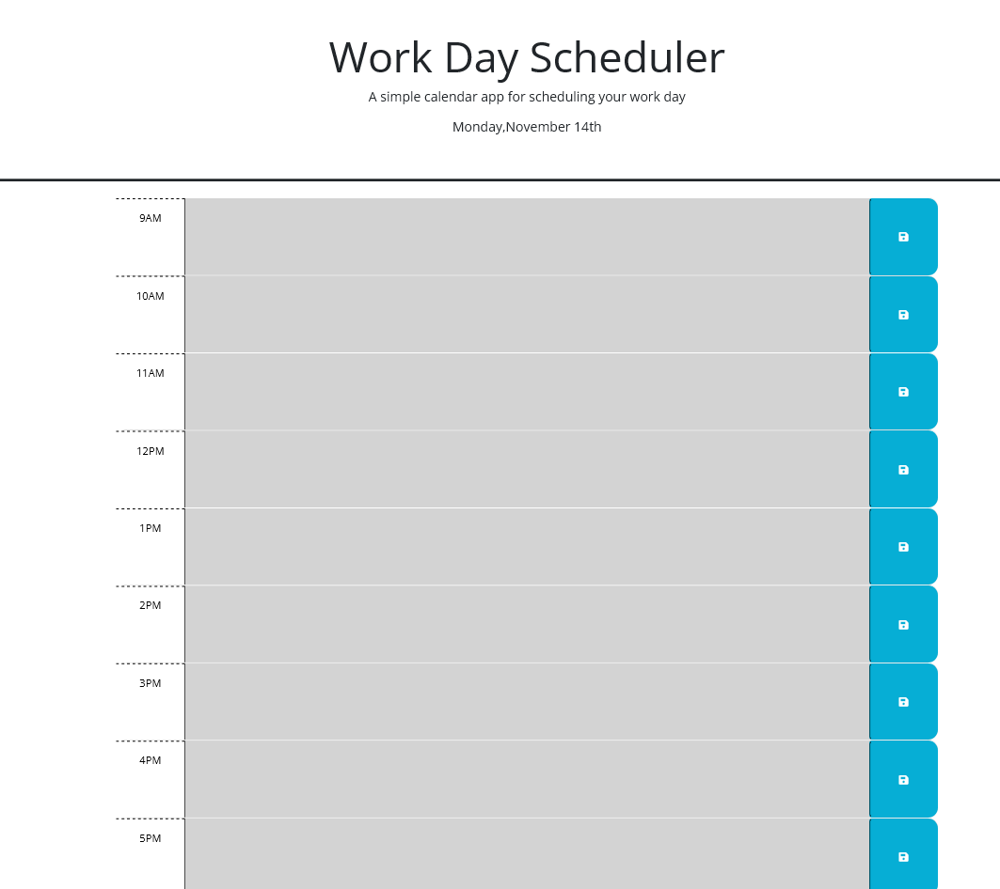
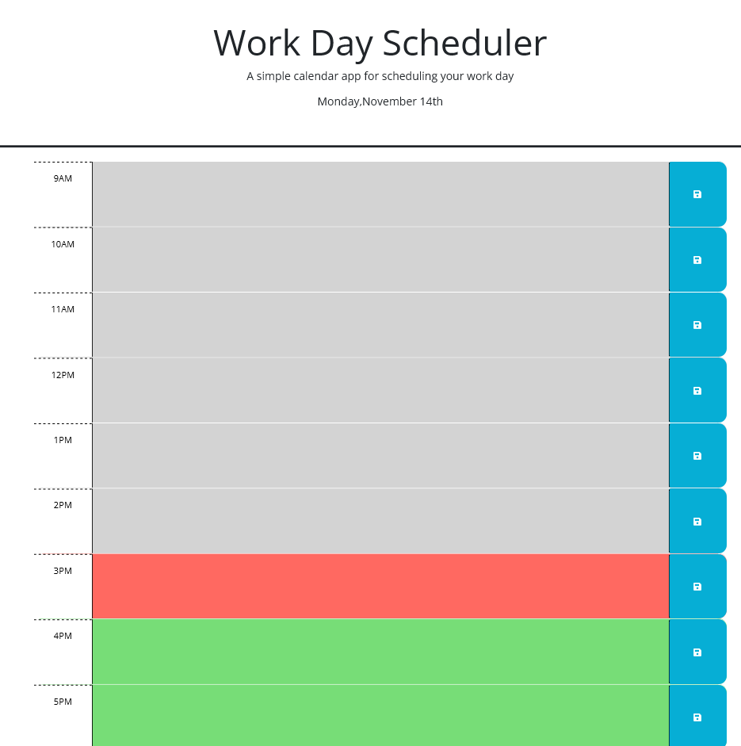

# Introduction:

Work Day Scheduler application powered by JavaScript with clean code. You can create your work schedules of professional business hours per day. All you have to do is to click on the save icon after writing your work event, your work will be stored.

You can differentiate between time by colors.

-   Grey indicates past time.
-   Red indicates present time.
-   Green indicates future time.

## Developer Insights:

I am thankful to my instructors at RutgersCodingBootcamp, that they teach me so well and I have crated this coding application.

## Resources:

-   [W3SCHOOLS.COM](https://www.w3schools.com/jsref/met_win_prompt.asp)
-   [Day.js](https://day.js.org/en/)
-   [Date Formatting](https://day.js.org/docs/en/parse/string-format)
-   [Date/Time Difference](https://day.js.org/docs/en/display/difference)

## ScreenShots

**Time blocks with all past times:**

**Time blocks with grey indicating past, red indicating present green indicating future:**

